```mermaid
flowchart TB

%% =========================
%% Color settings
%% =========================
classDef ui fill:#A7F3D0,stroke:#065F46,stroke-width:2px,color:#000,font-weight:bold
classDef exec fill:#BFDBFE,stroke:#1E40AF,stroke-width:2px,color:#000,font-weight:bold
classDef core fill:#FEF08A,stroke:#854D0E,stroke-width:2px,color:#000,font-weight:bold
classDef data fill:#D1FAE5,stroke:#065F46,stroke-width:2px,color:#000,font-weight:bold
classDef analytics fill:#FDE68A,stroke:#92400E,stroke-width:2px,color:#000,font-weight:bold
classDef output fill:#EDE9FE,stroke:#5B21B6,stroke-width:2px,color:#000,font-weight:bold
classDef cicd fill:#FED7AA,stroke:#9A3412,stroke-width:2px,color:#000,font-weight:bold
classDef release fill:#BBF7D0,stroke:#065F46,stroke-width:2px,color:#000,font-weight:bold

%% =========================
%% USER INTERFACE LAYER
%% =========================
subgraph UI_Layer [UI Layer]
    CLI[CLI Interface<br/>main.py]:::ui
end

%% =========================
%% EXECUTION LAYER
%% =========================
subgraph Execution_Engine [Execution Engine]
    PIPE[Parallel Processing<br/>pipeline.py]:::exec
end

%% =========================
%% CORE ARITHMETIC
%% =========================
subgraph Computational_Core [Computational Core]
    ARITH[JIT Arithmetic<br/>arithmetic.py]:::core
end

%% =========================
%% DATA LAYER
%% =========================
subgraph Data_Layer [Data Layer]
    CSV[(Prime Data<br/>CSV Files)]:::data
end

%% =========================
%% ANALYTICS LAYER
%% =========================
subgraph Analytics [Analytics]
    REPORT[Excel Reports<br/>reporting.py]:::analytics
    FIG[High-Res Figures<br/>figures.py]:::analytics
end

%% =========================
%% RESEARCH OUTPUT
%% =========================
subgraph Scholarly_Artifacts [Scholarly Artifacts]
    PAPER[LaTeX Manuscript<br/>paper/]:::output
    SUPP[Supplementary<br/>Material]:::output
end

%% =========================
%% CI / CD LAYER
%% =========================
subgraph CICD_Infrastructure [CI/CD Infrastructure]
    CI[GitHub Actions<br/>Matrix Testing]:::cicd
    TEST[Pytest + Coverage]:::cicd
    BUILD[Build + Versioning]:::cicd
end

%% =========================
%% RELEASE LAYER
%% =========================
subgraph Release_Layer [Open Science Release]
    GHREL[GitHub Release<br/>v1.0.0]:::release
    ZENODO[Zenodo DOI<br/>10.5281/zenodo.18764803]:::release
end

%% =========================
%% FLOW CONNECTIONS
%% =========================
CLI -->|Input| PIPE
PIPE -->|Compute| ARITH
ARITH -->|Store| CSV

CSV -->|Analyze| REPORT
CSV -->|Visualize| FIG

FIG -->|Include| PAPER
REPORT -->|Attach| PAPER

CI -->|Run| TEST
TEST -->|Validate| BUILD
BUILD -->|Deploy| GHREL
GHREL -->|Archive| ZENODO

PIPE -.->|Validated| TEST
ARITH -.->|Unit Tests| TEST
FIG -.->|Regression| TEST
REPORT -.->|Validated| TEST

%% استایل Ùلش‌ها
linkStyle default stroke:#4B5563,stroke-width:2px;

```

# fibonacci-cm-elliptic

**Numerical verification of the identity $S_p = -a_p(E)$ for Fibonacci quadratic character sums and the CM elliptic curve $E: y^2 = x^3 - 4x$.**

[](https://www.python.org/)
[](LICENSE)
[](https://doi.org/10.5281/zenodo.18764803)
[](tests/)


---

## 📄 Paper

> Ghandali, M. (2026). *Quadratic Residuosity in Fibonacci Sequences:
> Arithmetic Structure via CM Elliptic Curves and Twisted Character Sums.*

**Main result (Theorem 1.3):** For every prime $p > 5$ inert in $\mathbb{Q}(\sqrt{5})$,

$$S_p := \sum_{n=1}^{p+1} \chi(F_n \bmod p) = -a_p(E)$$

where $\chi$ is the Legendre symbol mod $p$ and $a_p(E) = p+1 - \\#E(\mathbb{F}_p)$ is the Frobenius trace of $E$.

---

## 🔬 Mathematical Clarification: Two Notions of "Inert"

This project involves **two distinct arithmetic notions of inert primes**, which must be clearly separated:

| Concept | Field | Arithmetic Condition | Role in the Paper |
|---------|-------|---------------------|-------------------|
| Inert in $\mathbb{Q}(\sqrt{5})$ | Fibonacci field | $p \equiv \pm 2 \pmod{5}$ | Hypothesis of Theorem 1.3 (torus orbit structure) |
| Inert in $\mathbb{Q}(i)$ | CM field of $E$ | $p \equiv 3 \pmod{4}$ | CM property: $a_p(E) = 0$ |

These conditions are **independent**. For example:

- $p = 13$: inert in $\mathbb{Q}(\sqrt{5})$ since $13 \equiv 3 \pmod{5}$ ✔, but **split** in $\mathbb{Q}(i)$ since $13 \equiv 1 \pmod{4}$, hence $a_{13}(E) = -2 \neq 0$. Nevertheless $S_{13} = 2 = -a_{13}(E)$ ✔
- $p = 7$: inert in $\mathbb{Q}(\sqrt{5})$ since $7 \equiv 2 \pmod{5}$ ✔, and also inert in $\mathbb{Q}(i)$ since $7 \equiv 3 \pmod{4}$, hence $a_7(E) = 0$ and $S_7 = 0$ ✔

The identity $S_p = -a_p(E)$ holds for all primes inert in $\mathbb{Q}(\sqrt{5})$, regardless of whether $a_p(E)$ vanishes. The vanishing $a_p(E) = 0$ occurs only when $p$ is additionally inert in $\mathbb{Q}(i)$.

In the dataset, the columns `type_E` and `type_F5` track these two conditions separately (see §Dataset Schema).

---

## 📁 Repository Structure

```text 
fibonacci-cm-elliptic/
├── .github/
│   └── workflows/
│       ├── ci.yml                          # Enterprise CI/CD: Testing, coverage & build validation
│       └── zenodo-release.yml              # Research Artifact Publishing: DOI integration
├── src/                       
│   └── fibonacci_cm/
│       ├── __init__.py                     # Package initialization and metadata
│       ├── arithmetic.py                   # Core Arithmetic Engine: Pisano & Frobenius (Numba JIT)
│       ├── pipeline.py                     # Computational Pipeline: Parallel prime processing
│       ├── reporting.py                    # Analytical Reporting: Excel & statistical diagnostics
│       └── figures.py                      # Visualization Suite: 600 DPI publication plots
├── tests/                                
│   ├── test_arithmetic.py                  # Unit Tests: Math correctness & period verification
│   ├── test_pipeline_figures_reporting.py  # Integration Tests: End-to-end validation
│   └── test_properties.py                  # Property-Based Testing: Algebraic invariants
├── paper/                      
│   ├── fibonacci_paper_v2.tex              # Main Manuscript: AMS-standard LaTeX article
│   ├── supplementary_material.tex          # Extended proofs and computational tables
│   └── references.bib                      # Bibliography: BibTeX academic references
├── data/                                   # Generated research data & CSVs
├── figures/                                # Pre-rendered high-resolution figures for paper
├── main.py                                 # CLI Entry Point: Executes full pipeline
├── pyproject.toml                          # PEP 621 Configuration: Build system & metadata
├── requirements.txt                        # Legacy pip compatibility dependencies
├── LICENSE                                 # MIT License
├── .gitignore                              # Git exclusion rules
└── README.md                               # Project overview and research context
```

---
## 🏗 Architecture Overview



---
## ⚡ Quick Start

### 1. Clone and install

```bash
git clone https://github.com/Majid-Ghandali/fibonacci-cm-elliptic.git
cd fibonacci-cm-elliptic
pip install -e .
```

### 2. Run the computation

```bash
python main.py
```

### 3. Verify the main identity

```python
import pandas as pd

df = pd.read_csv("CM_Research_Outputs/Dataset_Raw_Primes.csv")

# ── CM property: a_p = 0 for primes inert in Q(i) ────────────────────────────
inert_E = df[df["type_E"] == "inert_E"]
assert (inert_E["a_p"] == 0).all(), "CM property violated!"
print(f"CM property verified for {len(inert_E):,} primes inert in Q(i).")

# ── Theorem 1.3: S_p = -a_p for primes inert in Q(sqrt(5)) ───────────────────
inert_F5 = df[df["type_F5"] == "inert_F5"]
assert (inert_F5["S_p"] == -inert_F5["a_p"]).all(), "Theorem 1.3 violated!"
print(f"Theorem 1.3 verified for {len(inert_F5):,} primes inert in Q(sqrt(5)).")
```

Expected output:
```
CM property verified for 74,516 primes inert in Q(i).
Theorem 1.3 verified for 74,965 primes inert in Q(sqrt(5)).
```

### 4. Run tests

```bash
pytest tests/ -v --cov=src/
```

---

## 📊 Numerical Results

All computations verified for **148,932 primes**, $3 \le p \le 1{,}999{,}993$:

| Statistic | Value |
|---|---|
| Total primes verified | 148,932 |
| Split primes ($p \equiv 1 \pmod{4}$) | 74,416 |
| Inert primes ($p \equiv 3 \pmod{4}$) | 74,516 |
| CM property ($a_p = 0$ for all inert) | ✅ exact |
| Empirical inert ratio | 0.500336 |
| Chebotarev deviation $\|\rho_\text{inert} - 1/2\|$ | 0.000336 (0.0336%) |
| Max Weil ratio $\|a_p\|/(2\sqrt{p})$ | 0.999999 (at $p = 1{,}996{,}573$, $a_p = 2826$) |
| Runtime | ≈ 11 min (15 cores, Numba JIT) |

---

## 🖼️ Figures

| Figure | Description |
|---|---|
| `Fig1_Trace_Analysis.png` | Frobenius trace scatter: split vs inert primes, $p \le 1{,}999{,}993$ |
| `Fig2_SatoTate.png` | Empirical distribution vs CM Sato–Tate density $\rho(x) = 1/(\pi\sqrt{4-x^2})$ |
| `Fig3_Convergence.png` | Chebotarev density convergence to $\delta = 1/2$ |

All figures are 600 dpi and publication-ready (pre-generated in `data/figures/`).

---

## 📚 Citation

```bibtex
@software{Ghandali2026,
  author    = {Ghandali, Majid},
  title     = {Quadratic Residuosity in {F}ibonacci Sequences:
               Arithmetic Structure via {CM} Elliptic Curves
               and Twisted Character Sums},
  year      = {2026},
  doi       = {10.5281/zenodo.18764803},
  url       = {https://github.com/Majid-Ghandali/fibonacci-cm-elliptic},
  version   = {v1.0.0},
  note      = {Preprint}
}
```

---

## ⚙️ Requirements

```
numpy>=1.24
pandas>=2.0
numba>=0.57
sympy>=1.12
matplotlib>=3.7
tqdm>=4.65
openpyxl>=3.1
pytest>=7.0
hypothesis>=6.0
```

---

## 🎯 Design Principles

- Strict separation of the two inertness conditions (`type_E` vs `type_F5`)
- Reproducible computational mathematics with 100% test coverage
- Large-scale verification with fault tolerance (resume/restart modes)
- Strict adherence to arithmetic bounds (Hasse bound, Chebotarev density)

---

## 📜 License

MIT License — see [LICENSE](LICENSE) for details.
